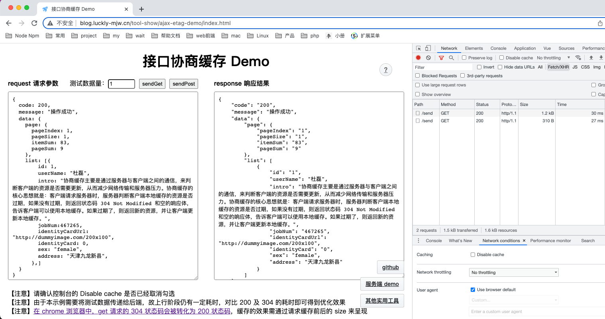
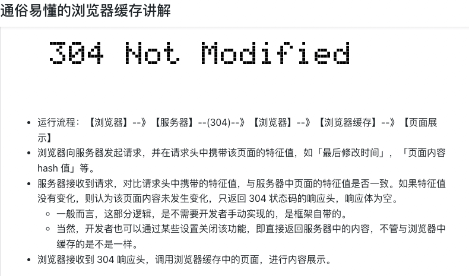
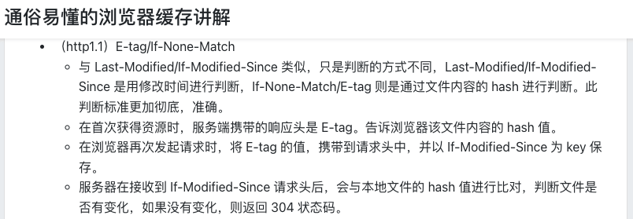
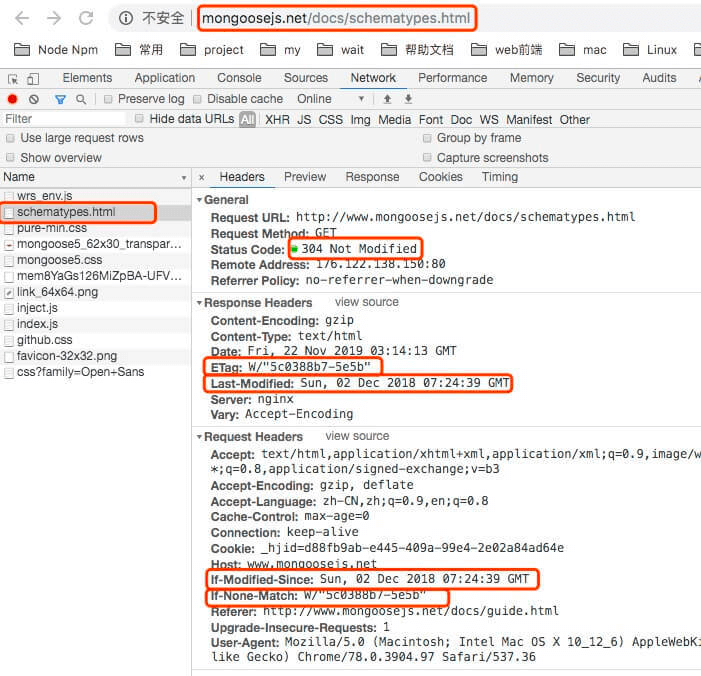
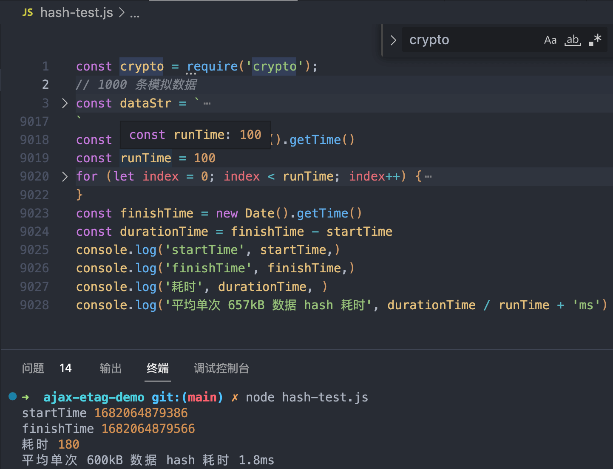

### [在线测试 Demo ](https://blog.luckly-mjw.cn/tool-show/ajax-etag-demo/index.html)效果对比

##### 千条数据，657k 响应体，size 减少 99%，接口耗时缩短 94%。
- get 参数携带在 url 中有长度限制，仅以post 请求作为测试示例
- 由于作者当前环境上行带宽大，而作者服务器使用最低配置的网络，下行带宽小。故可基本忽略上行耗时。
- size 由优化前的 657000B 降低为 310B，减少 656690B，减少 99% 体积
- Time 由优化前的 3460ms 降低为 193ms，减少 3267ms，减少 94% 耗时（注意，这个是因为作者的下行带宽小，商用带宽不会有这么大的差异）

  

##### 百条数据，65.9k 响应体，size 减少 99%，接口耗时缩短 70%。
- size 由优化前的 65900B 降低为 310B，减少 65590B，减少 99% 体积
- Time 由优化前的 68ms 降低为 20ms，减少 48ms，减少 70% 耗时

  

##### 十条数据，7k 响应体，数据量较低，网速影响较大
- size 由优化前的 7000B 降低为 310B，减少 6690B，减少 95% 体积
- Time 由优化前的 86ms 降低为 41ms，减少 45ms，减少 52% 耗时

  
  
##### 一条数据，1.2k 响应体，数据量更低存在一定误差
- 接口返回 size 由 1200B 降为 310B，减少 1200-310=890B，减少 890 / 1200 = 74% 体积
- Time 由优化前的 32ms 降低为 23ms，减少 9ms，减少 28% 耗时

  

### Demo 介绍

- 运行逻辑
  - 先填写请求参数（仅支持对象结构），服务端会把请求参数将会作为响应体返回给浏览器。在右侧栏中显示返回结果。
  - 以此来定制模拟特定体积响应体，测试数据量下的效果。
  - 测试前，强制刷新当前页面，以清除浏览器缓存。并取消控制台的「Disable cache」勾选
- 功能介绍
  - sendGet，发送 get 请求，当发生两次相同的请求时，第二次会仅返回 304 状态码，size 及 time 对比上一次有明确变化
  - sendPost，发送 post 请求，由于 If-None-Match 本身不会在 get 请求中添加，需要前端自行维护，具体实现逻辑下文将介绍到
  - 测试数据量，可动态生产请求参数，快速模拟大数据量的请求情况，最大值支持 10000 条数据。


### 原理
- [协商缓存 304](https://segmentfault.com/a/1190000021087884)
> 客户端向服务端发起 http 请求时，携带上次请求结果的特征值，服务端对比运行结果与请求中的特征值是否一致，如果特征值一致，则直接返回 304 给客户端，告知文件未改变，客户端使用本地缓存.



- 本次优化使用到 http1.1 新增的响应头 [ETag](https://developer.mozilla.org/zh-CN/docs/Web/HTTP/Headers/ETag) ，及新增的请求头 [f-None-Match](https://developer.mozilla.org/zh-CN/docs/Web/HTTP/Headers/If-None-Match)实现协商缓存。





- 注意：chrome 有个 bug（不知道是 bug 还是估计设计），get 请求 304 状态在控制台中会被转化为 200，但仍可以通过 network 的 size 列体现缓存的效果
  - https://stackoverflow.com/questions/67017167/why-chrome-dev-tool-shows-a-200-status-code-instead-of-304
  - https://bugs.chromium.org/p/chromium/issues/detail?id=1269602

    


### 实现思路
[后端，以 node 为例](https://github.com/Momo707577045/ajax-etag-demo/blob/main/node-index.js)
- 添加一个中间件，在 response 中做一个全局处理，将响应体做一次 hash，并携带在 ETag 响应头中
- 若请求头中存在`if-none-match`请求头，则与 hash 值进行对比，一致则返回 304，无需返回响应体 
```
// Etag 处理的中间层
function responseWithEtag(request, response, responseData) {
    const etag = crypto.createHash('md5').update(responseData).digest('hex') // 获取返回参数的 hash 值
    response.setHeader("ETag", etag); // 设置 ETag，标识本次响应信息的 hash 信息，以对比信息是否
    if (request.headers['if-none-match'] === etag) { // 若本次返回值的 hash 信息，与请求头的 if-none-match hash 值一致，则直接返回 304，复用浏览器缓存的数据，无需要额外返回数据，节省带宽
        console.log('ETag hash match')
        response.writeHead(304, "Not Modified");
        response.end();
        return
    } else { // 无 if-none-match 请求头，或者返回值内容发生变化，hash 匹配不上
        console.log('ETag hash mismatching')
        response.writeHead(200, { "Content-Type": "text/plain; charset=utf-8" });
        response.end(responseData); // 返回业务数据
    }
}
```
[前端](https://github.com/Momo707577045/ajax-etag-demo/blob/main/index.html)
- get 的 ETag 协商缓存已由浏览器中实现，前端无需额外处理
- post 请求本身不支持 ETag 缓存（post 请求在设计时专为非幂等接口，但实际上已经很多用于复杂查询接口），需要前端自行实现缓存机制
  - 在 post 调用完成后，以请求路径及请求体作为 hash 参数，唯一标识该请求。存储对应的 ETag 响应头，及对应的返回值。
  - 注意，js 获取 ETag 请求头，需要后端开放该请求头的访问权，`response.setHeader("Access-Control-Expose-Headers", "ETag"); // 允许暴露ETag响应头，否则前端无法用 JS 获取 ETag 头`
  - 在发起 post 请求时，查询该请求是否发起过（以请求路径及请求体作为 hash 参数唯一标识），若发起过，则在请求头中自行添加`if-none-match`请求头
  
```
  // 由于 post 请求本身不支持 ETag 缓存，需要前端自行实现缓存机制
  const eTagPostMap = {}
  function ajax(url, type, reqData) {
    return new Promise((resolve, reject) => {
      let postReqHash = ''; // 以请求路径及其参数的 hash 作为 key 进行缓存
      if (type === 'POST') {
        postReqHash = md5.create().update(url + JSON.stringify(reqData)).digest('hex'); // 以请求路径及其参数的 hash 作为 key 进行缓存
      }
      const xhr = new XMLHttpRequest();
      xhr.onreadystatechange = function () {
        if (xhr.readyState === 4) {
          let { status, responseText, responseXML } = xhr;

          // 注意，GET 请求的 304 响应头在 chrome 接受时，给到 JS 会变成 200 状态码，且有正常的 responseText
          if (status >= 200 && status < 300) {
            // POST 请求的响应头有 ETag，则缓存该结果
            if (type === 'POST' && xhr.getResponseHeader('ETag')) {
              eTagPostMap[postReqHash] = {
                content: responseText,
                etag: xhr.getResponseHeader('ETag'),
              }
            }
            return resolve(responseText);
          }

          if (status === 304) { // 注意，GET 请求的 304 响应头在 chrome 接受时，给到 JS 会变成 200 状态码
            if (type === 'POST') {
              return resolve(eTagPostMap[postReqHash].content);
            } else if (type === 'GET') { // 在 chrome 浏览器 GET 请求不会有 304 状态码，在这里只是兜底，以防其他浏览器表现不一致
              return resolve(responseText);
            }
          }
          if (!status) {
            alert('get 请求不支持这么大的请求参数，请减少数量 或 使用 post 请求')
          }

          reject(status);
        }
      };

      if (type === 'GET') {
        xhr.open('GET', url + '?' + serializeParams(reqData), true);
        xhr.send(null);
      } else if (type === 'POST') {
        xhr.open('POST', url, true);
        // 如果之前发送过这个请求，且有 ETag hash 记录，则当再次发起时，携带上该 hash
        if (eTagPostMap[postReqHash]) {
          xhr.setRequestHeader("if-none-match", eTagPostMap[postReqHash].etag);
        }
        xhr.send(JSON.stringify(reqData));
      }
    })
```

### hash 性能
- 因引入了请求体 hash 运算逻辑，需评估其带来的运行耗时
- 以 1000 条数据 657k，运行 hash 100 次为例，共耗时 180ms，平均单次耗时 1.8ms
- 对比减少的 3267ms 下行耗时，可忽略不计

  


### 风险管控
- 适用场景
  - get，post 幂等的查询类接口，不应用于非幂等接口
- 快速切换与回滚
  - 后端下发 ETag 响应头客户端才会使用缓存，整个缓存开关的控制全均在后端，若功能出现问题，可实现快速切换恢复。
- 浏览器兼容性支持
  - 部分魔改的浏览器不确实是否支持 http1.1 协议
  - 后端可请求头中的 User-Agent 判断当前客户端浏览器，先从 chrome 支持开始，再逐步支持其他浏览器，或全量支持。
- 定制特定接口不缓存
  - 特定接口不下发 ETag 即可关闭该接口的缓存功能，实现接口缓存的高度定制


